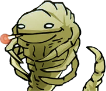

# Facehuggers

Facehuggers is a hyperlink catcher based on [Nicolas Lantoing's Facehugger](https://github.com/nlantoing/facehugger). It hugs your website's face. Gently.

## Usage

```javascript
const facehuggers = new Facehuggers();
```

It adds a `click` event listener on `window` and check wether its a link that has been clicked and if it points to the current domain. It also handle clicks on the "back" button of the browser via `onpopstate`.

On such event, Facehuggers will try to retrieve the pointed document.

A custom `FacehuggersNewDocumentLoadStart` event will then be triggered to mark the start of the document retrieval and, logically, a `FacehuggersNewDocumentLoadEnd` event will be triggered on document retrieval end. Along with the latest, the `detail` property of the event will contain an object will the following properties:

* **document**: the retrieved document.
* **element**: the element which has been clicked, if any.
* **type**: the type of event which triggered the event. Can be either `facehuggers.LINK` or `facehuggers.BACK_BUTTON`. 

## Example

```javascript
document.addEventListener(
    'FacehuggersNewDocumentLoadEnd',
    function (event) {
        const
            detail = event.detail,
            detailDocument = detail.document,
            type = (detail.type === facehuggers.BACK_BUTTON)
                ? 'previous'
                : (
                    detail.element.getAttribute('rel') === 'prev'
                        ? 'previous'
                        : 'next'
                )
        ;

        loadPage(type, detailDocument);
    }
);
```

## Copyright

The character below come from the copyrighted comics [VG Cats](https://www.vgcats.com/comics/) episode 114 ["That's saying a mouthful"](https://www.vgcats.com/comics/?strip_id=108).


